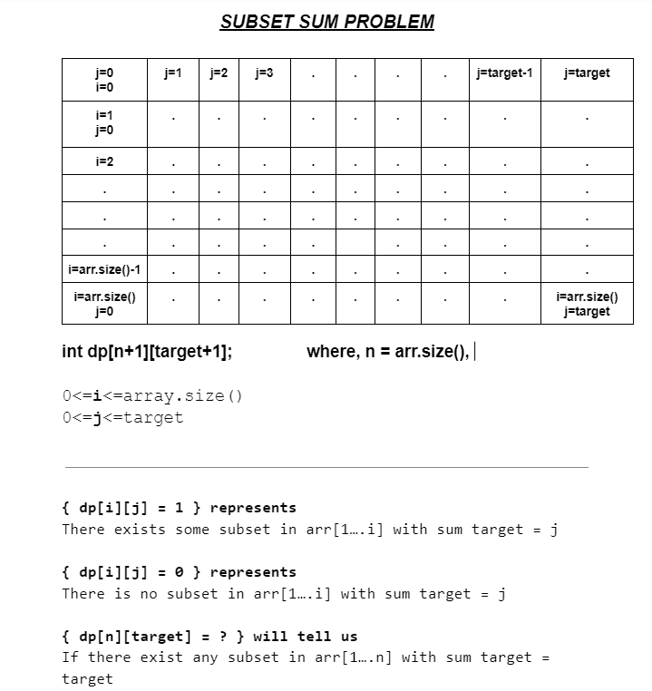

<h1> DAA - TA 2 (25th Nov 2022)</h1>

Name : Prathamesh Rajendra Rajbhoj <br>
Sec  : A <br>
Sem  : 5 <br>
Roll : 53 <br>

<hr>

# Implement <ins>**SUM OF SUBSET**</ins> problem using Dynamic Programming approach and demonstrate any two applications in the form of test cases.

<p> For Roll No: 24,45,52,53 <p>

<hr>

## LOGIC 



```
- Create a DP matrix as shown in figure above

- Start Recursion from dp[n][target]

- for every index we have 2 options
        -> to consider index in subset
        -> not consider index in subset
        
- If we find sum of subset = target, return true, else continue recursion    
        
- We will have overlapping Subproblems, and we will save time by not calculating overlapping subproblems again and again

- once we calculate & its value in dp[][] is changed from -1 to 0/1, we wont be calculating it again if we encounter that subproblem again in recursion

```

## Time Complexity : ```O(n*target )```

## Space Complexity : ```O(n*target + 2*n )```

n*target -> for Dp matrix <br>
n -> for Recursion stack <br>
n  -> for array <br>

<hr>

## CODE

```
#include <bits/stdc++.h>
using namespace std;
typedef long long ll;
typedef unsigned long long ull;
#define pb push_back
#define ff first
#define ss second
#define sortvec(v) sort(v.begin(), v.end())
#define revvec(v) reverse(v.begin(), v.end())


vector<int> path;

void findSubset(vector<int> &v, int ind, int target, vector<vector<int>> &dp)
{
    if (ind < 0 || target < 0)
    {
        return;
    }

    if (target == 0)
    {
        return;
    }

    if (ind == 0)
    {
        path.push_back(v[ind]);
        return;
    }

    if (dp[ind][target] == 1)
    {
        if (ind >= 1 && target >= v[ind] && dp[ind - 1][target - v[ind]] == 1)
        {
            findSubset(v, ind - 1, target - v[ind], dp);
            path.push_back(v[ind]);
        }
        else if (ind >= 1 && target >= 0 && dp[ind - 1][target] == 1)
        {
            findSubset(v, ind - 1, target, dp);
        }
    }
}


bool subsetSum(vector<int> &v, int ind, int target, vector<vector<int>> &dp)
{
    // cout<<ind<<" "<<target<<endl;

    if (target == 0)
    {
        dp[ind][target] = 1;
        return true;
    }

    if (ind == 0)
    {
        if (v[0] == target)
        {
            dp[ind][target] = 1;
            return true;
        }
        else
        {
            dp[ind][target] = 0;
            return false;
        }
    }

    if (dp[ind][target] != -1)
    {
        return dp[ind][target];
    }

    int notTake = subsetSum(v, ind - 1, target, dp);

    int take = false;

    if (v[ind] <= target)
    {
        take = subsetSum(v, ind - 1, target - v[ind], dp);
    }

    return dp[ind][target] = take | notTake;
}


int main()
{
    vector<int> v = {1, 2, 3, 5, 8, 9, 10};

    int n = v.size();
    int target = 17;
    
    

    cout << "Array is : ";
    for (auto i : v)
    {
        cout << i << " ";
    }
    cout << "\n\n";
    
    

    vector<vector<int>> dp(n, vector<int>(target + 1, -1));


    int ans = subsetSum(v, n - 1, target, dp);

    if (ans == 1)
    {
        cout << "YES, Subset with sum " << target << " is present " << "\n\n";
    }
    else
    {
        cout << "No Possible Subset" << "\n\n";
        return 0;
    }


    findSubset(v, n - 1, target, dp);
    

    cout << "Possible Subset is : ";
    for (auto i : path)
    {
        cout << i << " ";
    }
    cout << "\n\n";

    return 0;
}
```


<hr>

## Test Cases
```
Array is : 1 2 3 5 8 9 10 

Target is : 17

DP Matrix : 

 1	 1	 0	 0	 0	 0	 0	 0	 0	 0	 0	-1	 0	-1	 0	 0	-1	 0	
 1	 1	 1	 1	 0	 0	 0	 0	 0	 0	-1	-1	 0	-1	 0	-1	-1	 0	
-1	-1	 1	 1	 1	-1	-1	 0	 0	 0	-1	-1	 0	-1	-1	-1	-1	 0	
 1	-1	-1	-1	-1	-1	-1	 1	 1	 1	-1	-1	-1	-1	-1	-1	-1	 0	
-1	-1	-1	-1	-1	-1	-1	 1	 1	-1	-1	-1	-1	-1	-1	-1	-1	 1	
-1	-1	-1	-1	-1	-1	-1	 1	-1	-1	-1	-1	-1	-1	-1	-1	-1	 1	
-1	-1	-1	-1	-1	-1	-1	-1	-1	-1	-1	-1	-1	-1	-1	-1	-1	 1	


YES, Subset with sum 17 is present 

Possible Subset is : 2 5 10 

```

```
Array is : 1 1 1 8 

Target is : 11

DP Matrix : 

-1	 1	 0	 0	-1	-1	-1	-1	-1	 0	 0	 0	
-1	-1	 1	 0	-1	-1	-1	-1	-1	-1	 0	 0	
-1	-1	-1	 1	-1	-1	-1	-1	-1	-1	-1	 0	
-1	-1	-1	-1	-1	-1	-1	-1	-1	-1	-1	 1	


YES, Subset with sum 11 is present 

Possible Subset is : 1 1 1 8 

```

```
Array is : 1 2 3 4 

Target is : 14

DP Matrix : 

-1	-1	-1	-1	-1	 0	-1	 0	 0	 0	 0	 0	 0	-1	 0	
-1	-1	-1	-1	-1	-1	-1	 0	-1	-1	 0	 0	-1	-1	 0	
-1	-1	-1	-1	-1	-1	-1	-1	-1	-1	 0	-1	-1	-1	 0	
-1	-1	-1	-1	-1	-1	-1	-1	-1	-1	-1	-1	-1	-1	 0	


No Possible Subset
```


<hr>

## APPLICATIONS
```
1. Chosing Exact amount of money while shopping

-> Suppose we are at grocery shop and we need to pay some exact amount (say 17 in cash) to owner.
-> We have currency present with us as : {1 2 3 5 8 9 10}
-> If we dont have exact amount to pay, we can not buy items
-> So here, we can use subset sum problem to find out if we can pay exact amount of money to owner or not
-> As shown in test case 1, we can pay owner 17 by giving him subset {2 5 10}

```

```
2. Chosing Weights in Old-Weighing Machines

-> In Old-Weighing Machines (which were used earlier), blocks of different weights were used to measure weight of items
-> Suppose we have blocks of weights {10 20 50 100 250 500 1000}
-> and we need to weigh some items (lets same weigh = 620)
-> we can use subset sum problem + hit and trial method to chose some subset and find weight of item
-> Here we can use {20 100 500} weighs to measure item of weight 620

```
